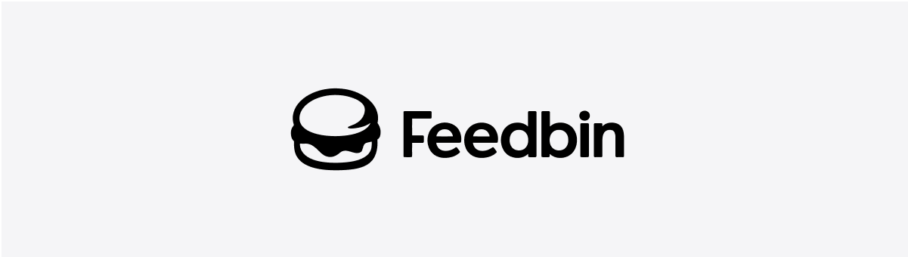
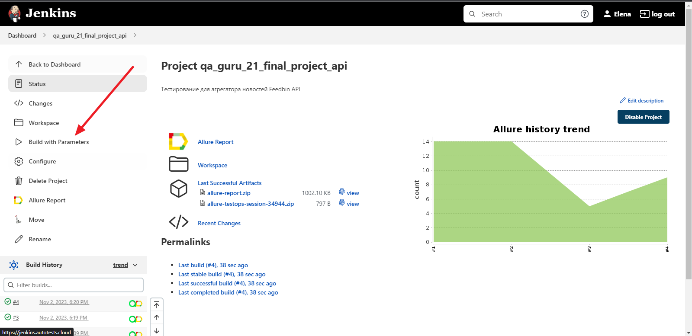
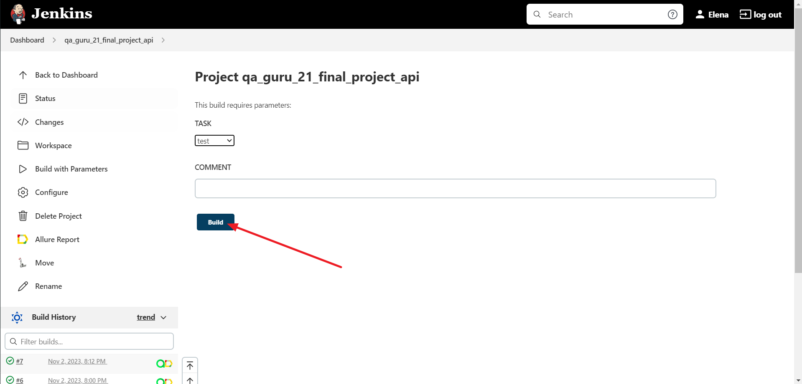
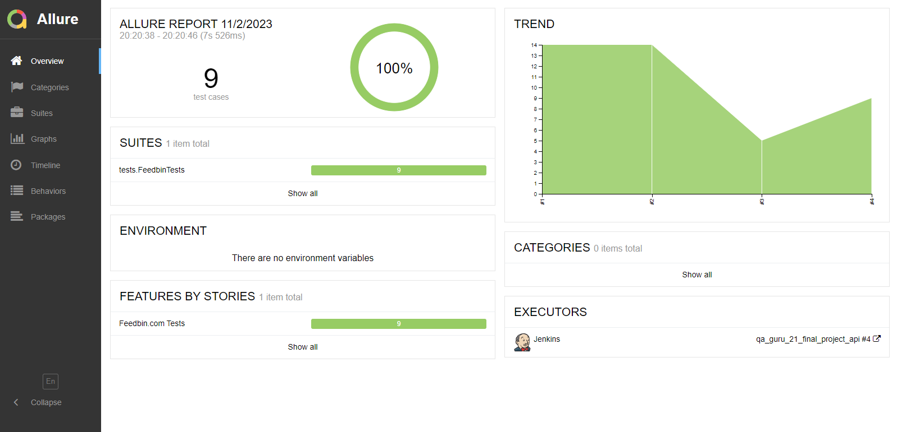
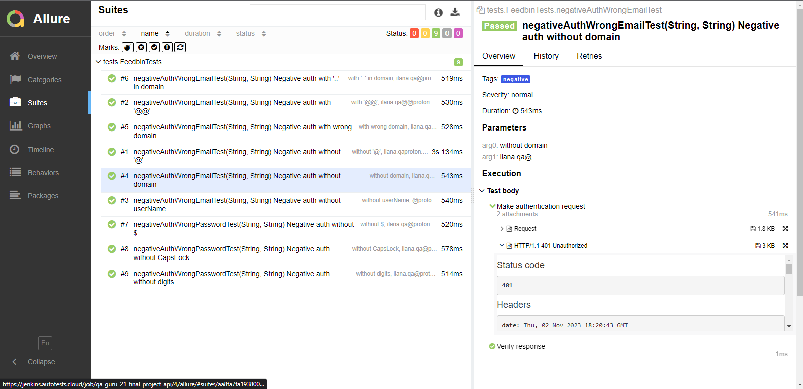
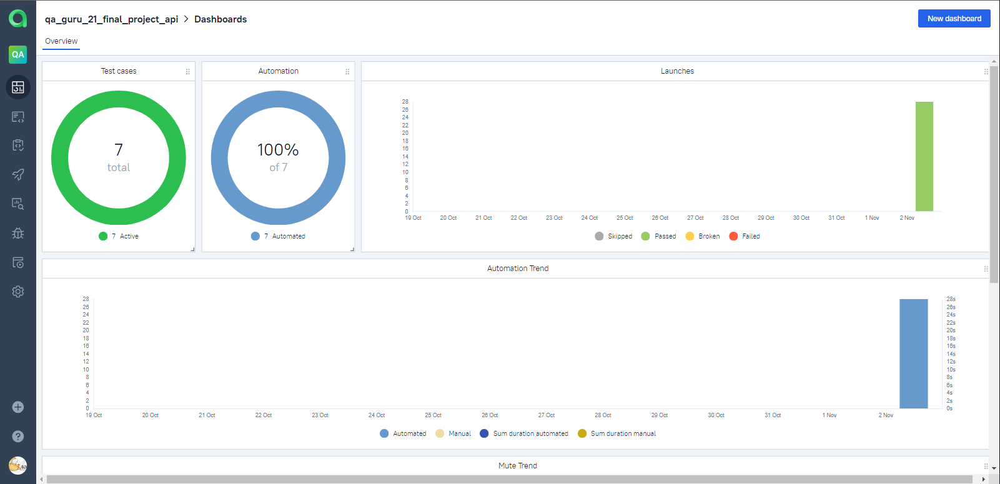
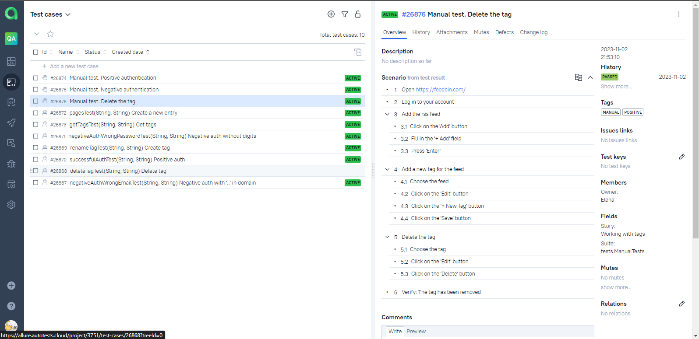
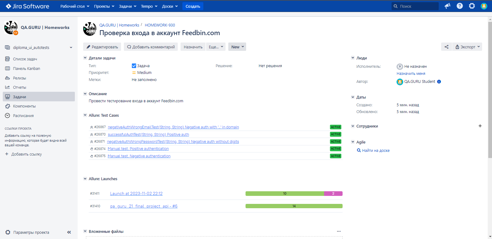
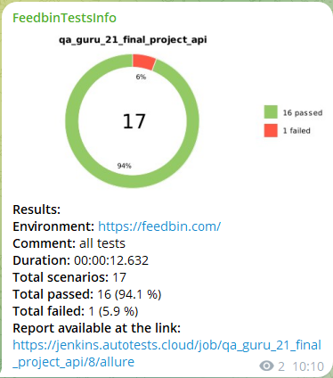

# Проект по автоматизации тестирования для агрегатора новостей Feedbin (API)

    

> Хорошее место для чтения в сети.  
> Следите за своими увлечениями с помощью RSS, рассылок по электронной почте, подкастов и YouTube.

## [Содержание](#Содержание)
[Технологии и инструменты](#Технологии-и-инструменты)  
[Реализованные проверки](#Реализованные-проверки)  
[Локальный запуск тестов из терминала](#Локальный-запуск-тестов-из-терминала)  
[Сборка в Jenkins](#Сборка-в-Jenkins)  
[Удаленный запуск из терминала](#Команда-для-удаленного-запуска-автотестов-из-терминала)  
[Интеграция с Allure Report](#Интеграция-с-Allure-Report)  
[Интеграция с Allure TestOps](#Интеграция-с-Allure-TestOps)  
[Интеграция с Jira](#Интеграция-с-Jira)  
[Уведомление в Telegram](#Уведомление-в-Telegram)  

### Технологии и инструменты

Автотесты написаны на языке `Java` с использованием `JUnit 5`, `Selenide`. Сборщик проекта - `Gradle`. Для удаленного запуска реализована задача в `Jenkins` с формированием `Allure-отчета` и
отправкой результатов в `Telegram` при помощи бота. Так же осуществлена интеграция с `Allure TestOps` и `Jira`.

    
    
    
    
    
    
    
    
    
    
    

[Назад к содержанию](#Содержание)

### Реализованные проверки
- Успешная/неуспешная авторизация пользователя
- Создание новой записи
- Получение всех тегов
- Создание нового тега
- Удаление тега

[Назад к содержанию](#Содержание)

### Локальный запуск тестов из терминала
`gradle clean test`

[Назад к содержанию](#Содержание)

### Сборка в [Jenkins](https://jenkins.autotests.cloud/job/qa_guru_21_final_project_api/)
Для запуска сборки необходимо перейти на страницу проекта [qa_guru_21_final_project_api](https://jenkins.autotests.cloud/job/qa_guru_21_final_project_api/)
в `Jenkins`, далее в раздел `Build with Parameters`, выбрать необходимые параметры и нажать
кнопку `Build`.

    
    

[Назад к содержанию](#Содержание)

### Интеграция с [Allure Report](https://jenkins.autotests.cloud/job/qa_guru_21_final_project_api/allure/)
При удаленном запуске тестов в `Jenkins`, автоматически генерируется `Allure Report`

##### [Overview](https://jenkins.autotests.cloud/job/qa_guru_21_final_project_api/allure/#)

    

##### [Test details](https://jenkins.autotests.cloud/job/qa_guru_21_final_project_api/allure/#behaviors/5778946ce3195933e780791617eb6bb7/7cfd74cd081d7033/)

    

[Назад к содержанию](#Содержание)

### Интеграция с [Allure TestOps](https://allure.autotests.cloud/project/3751/test-cases/26872?treeId=0)

В отчете `Allure TestOps` можно:
- просматривать созданные тест-кейсы и чек-листы,
- запускать ручные и автоматические тестовые прогоны,
- заводить дефекты,
- собирать статистику о проделанной работе.

##### [Allure TestOps Dashboard](https://allure.autotests.cloud/project/3751/dashboards)

    

##### [Ручные и автоматические тест-кейсы](https://allure.autotests.cloud/project/3751/test-cases?treeId=0)

  
    

[Назад к содержанию](#Содержание)

### Интеграция с [Jira](https://jira.autotests.cloud/browse/HOMEWORK-930)

Интеграция `Allure TestOps` с `Jira`, позволяет отображать в [задаче](https://jira.autotests.cloud/browse/HOMEWORK-930),
созданной в `Jira`, какие тест-кейсы были написаны в рамках задачи и результат их выполнения.

    

[Назад к содержанию](#Содержание)

### Уведомление в Telegram

После завершения сборки, автоматически отправляется отчет о результатах выполнения тестов в специально созданный `Telegram канал`.

    

[Назад к содержанию](#Содержание)